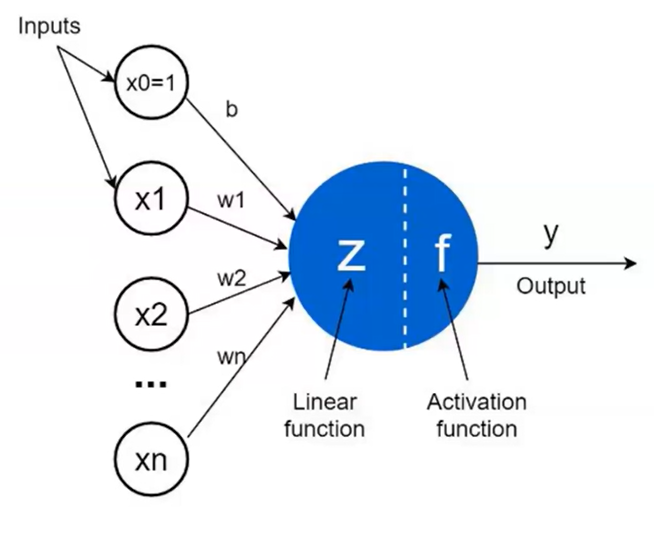
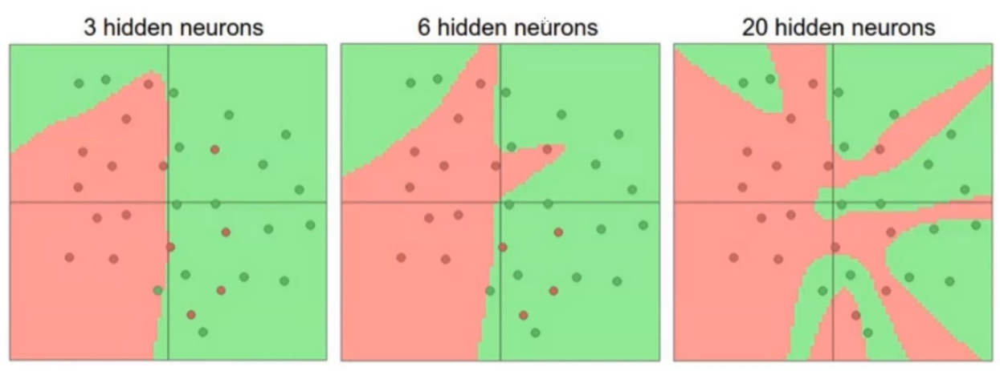
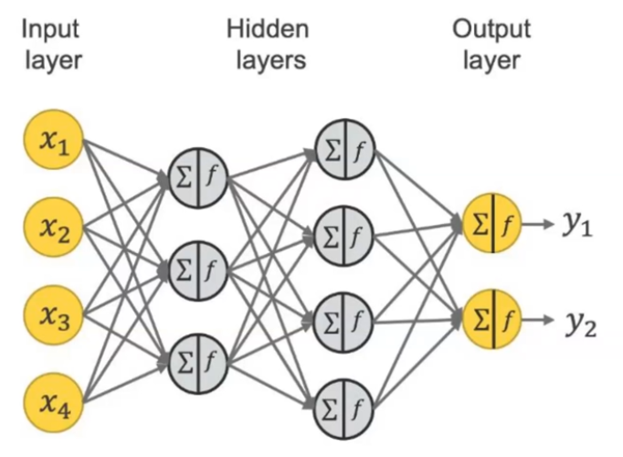
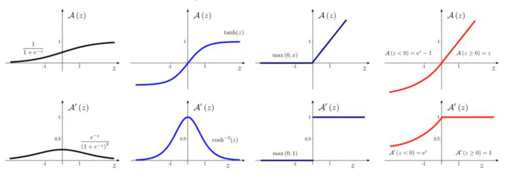
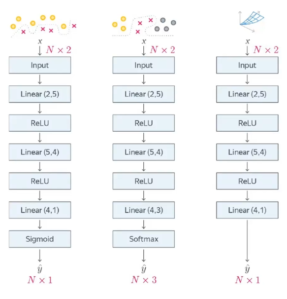
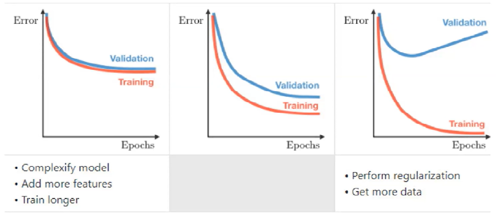
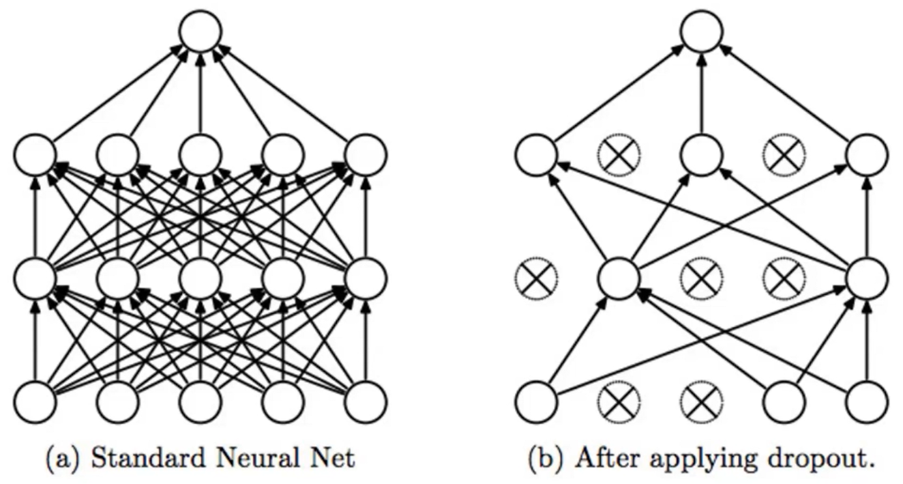

- [Полезное](#полезное)
- [\[Лекция 1\] Введение в полносвязные сети](#лекция-1-введение-в-полносвязные-сети)
  - [Перцептрон](#перцептрон)
  - [Полносвязная сеть](#полносвязная-сеть)
  - [Функция активации](#функция-активации)
- [\[Лекция 2\] Регуляризация](#лекция-2-регуляризация)
  - [Типичный train loop в PyTorch](#типичный-train-loop-в-pytorch)
  - [Overfitting \& Underfitting](#overfitting--underfitting)
  - [Dropout](#dropout)
  - [Batch Normalization](#batch-normalization)
  - [Стохастический градиентный спуск (SGD)](#стохастический-градиентный-спуск-sgd)
  - [Связь SGD и L2 регуляризации](#связь-sgd-и-l2-регуляризации)
  - [Adam](#adam)
  - [AdamW](#adamw)

<!-- 

Ctrl+Shift+V - open preview

Ctrl+Shift+P + "Markdown All in One: Create Table of Content"

git add .
git commit --allow-empty-message -m ''
git push origin main

-->

# Полезное

$$0.3\cdot HW + 0.3\cdot Tests + 0.4 \cdot Exam$$

* [Записи занятий](https://disk.360.yandex.ru/d/-i0quAMsXqNabw/2%20%D0%BA%D1%83%D1%80%D1%81%20%D0%9C%D0%9D%D0%90%D0%94-24/%D0%9C%D0%B0%D1%88%D0%B8%D0%BD%D0%BD%D0%BE%D0%B5%20%D0%BE%D0%B1%D1%83%D1%87%D0%B5%D0%BD%D0%B8%D0%B5%202?clckid=a86ec8e9)


# [Лекция 1] Введение в полносвязные сети

* [Запись](https://disk.360.yandex.ru/d/-i0quAMsXqNabw/2%20%D0%BA%D1%83%D1%80%D1%81%20%D0%9C%D0%9D%D0%90%D0%94-24/%D0%9C%D0%B0%D1%88%D0%B8%D0%BD%D0%BD%D0%BE%D0%B5%20%D0%BE%D0%B1%D1%83%D1%87%D0%B5%D0%BD%D0%B8%D0%B5%202/1%20%D0%BF%D0%BE%D1%82%D0%BE%D0%BA/1.%2006.09.25%20%D0%9C%D0%B0%D1%88%D0%B8%D0%BD%D0%BD%D0%BE%D0%B5%20%D0%BE%D0%B1%D1%83%D1%87%D0%B5%D0%BD%D0%B8%D0%B5%202_%D0%9B%D0%B5%D0%BA%D1%86%D0%B8%D1%8F_1%20%D0%BF%D0%BE%D1%82%D0%BE%D0%BA.mp4?clckid=a86ec8e9)

## Перцептрон
<p align="center">

</p>

Принимает $n$ чисел на вход $x_1$, $x_2$, ..., $x_n$ и возвращает одно число $y$.

$y = f(Z(x_1, x_2, ..., x_n))$

$f$ - "функция активации"

$Z$ - линейная функция вида $x_1\omega_1 + x_2\omega_2 + ... + x_n\omega_n + b$

Для удобства можно вынети коэффициент $b$ из $Z$ и добавить еще один параметр на вход $x_0=1$

Все это нужно, например, для задач бинарной классификации, когда классы друг от друга линейной функцией мы разделить не можем.

<p align="center">

</p>

## Полносвязная сеть

"Multilayer Perceptron" или "Fully Connected Neural Network" - объединяем перцептроны в полносвязную сеть. Выход каждого перцептрона на одном слое подается в качетсве входа в каждый перцептрон на следующем слое.

<p align="center">

</p>

Рассмотрим самую простую "нейросеть" с одним перцептроном:

* $x\in\mathbb{R}^n$ - фичи из датасета
* $y\in\mathbb{R}$ - target
* $\theta\in\Theta$ (или $w\in W$) - параметры нейросети
* $f_{\theta}(x) = x^\intercal\times\theta = x_1\theta_1 + x_2\theta_2 + ... + x_n\theta_n$ - нейросеть из одного перцептрона
* $\{(x_i,y_i)\}$ - training set
* $\mathcal{L}(\hat{y}, y)$ - loss function

Надо минимизировать "эмпирический риск" $\quad\frac{1}{n}\sum_{i=1}^{n} \mathcal{L}(\hat{y_i}, y_i)$ \
Для этого можно использовать градиентный спуск (для этого $f$ и $\mathcal{L}$ должны быть дифференцируемы)

Чтобы понять, как считать градиент $\nabla(\mathcal{L})$, воспользуемся свойством $y=f(g(x)) \quad\Rightarrow\quad \frac{dy}{dx} = \frac{df}{dg}\cdot\frac{dg}{dx}$

Тогда

$$y=f(g_1(x), g_2(x), ..., g_n(x)) \quad\Rightarrow\quad \frac{dy}{dx} = \sum_{i=1}^{n}\frac{df}{dg_i}\cdot\frac{dg_i}{dx}$$

То есть, чтобы посчитать градиент по всей нейросети, нужно пройтись по всем ее слоям в обратном порядке и восползьзоваться формулой выше (Backpropagation)

Теперь перейдем к случаю c полносвязной нейросетью, в которой $m$ слоев

* $x\in\mathbb{R}^n$
* $\{z_i\}_{i=1}^{m}$ - "logit" или вектор выходов для каждого из слоев
  * $z_1 = x \times \theta_1$
  * $z_2 = z_1 \times \theta_2$
  * ...
  * $z_m = z_{m-1} \times \theta_m$
  
Пока все было достаточно линейно, а мы хотим привнести какую-нибуь нелинейность в нашу модель

## Функция активации

Существует много разных функций активаций. Самые распространенные:

**Sigmoid** \
$\sigma(x) = \frac{1}{1+e^{-x}}\quad\quad\sigma'=\sigma(x)(1-\sigma(x))$

**tanh** \
$\tanh(x) = \frac{e^x-e^{-x}}{e^x+e^{-x}}\quad\quad \tanh'(x)=1-\tanh^2(x)$

**ReLU** \
$ReLU(x) = max(0, x)$

**Leaky ReLU** \
$LeakyReLU(x) = max(\alpha x, x)$

<p align="center">

</p>

Пусть $\sigma(.)$ - "функция активации" ($\sigma:\mathbb{R}\mapsto\mathbb{R}$), тогда мы можем переопределить $z_i$:
* $z_i=\sigma(z_{i-1}\theta_i+b_i)$

На самом деле, иногда активацию выносят на отдельные слои, а в некоторых моделях может быть несколько линейных слоев подряд без активации. В pytorch слои с активацией надо указывать отдельно. 

Простейшие примеры нейросетей:

<p align="center">

</p>

Здесь `Linear (x, y)` означает, что мы $x$ признаков подаем на вход $y$ перцептронам (нейронам), то есть в следующий слой каждому нейрону на вход подастся $y$ признаков.

# [Лекция 2] Регуляризация

* [Запись](https://disk.360.yandex.ru/d/-i0quAMsXqNabw/2%20%D0%BA%D1%83%D1%80%D1%81%20%D0%9C%D0%9D%D0%90%D0%94-24/%D0%9C%D0%B0%D1%88%D0%B8%D0%BD%D0%BD%D0%BE%D0%B5%20%D0%BE%D0%B1%D1%83%D1%87%D0%B5%D0%BD%D0%B8%D0%B5%202/1%20%D0%BF%D0%BE%D1%82%D0%BE%D0%BA/2.%2013.09.25%20%D0%9C%D0%B0%D1%88%D0%B8%D0%BD%D0%BD%D0%BE%D0%B5%20%D0%BE%D0%B1%D1%83%D1%87%D0%B5%D0%BD%D0%B8%D0%B5%202_%D0%9B%D0%B5%D0%BA%D1%86%D0%B8%D1%8F_1%20%D0%BF%D0%BE%D1%82%D0%BE%D0%BA.mp4?clckid=a86ec8e9)

## Типичный train loop в PyTorch

```py
model.train()
for epoch in range(num_epochs):
    for batch_inputs, batch_labels in train_loader:
        optimizer.zero_grad()
        outputs = model(batch_inputs)
        loss = criterion(outputs, batch_labels)
        loss.backward()
        optimizer.step()
```

`loss.backward()` отвечает за подсчет градиента

## Overfitting & Underfitting

<p align="center">

</p>

Underfitting (модель недообучается): примерно одинаковый **большой** loss на train и validation
* усложнить модель
* добавить больше фичей
* дольше обучать

Overfitting (модель переобучается): loss для train очень маленький, а для validation большой, причем со временем увеличивается
* остановить обучение модели в тот момент, когда loss на валидационной выборке начинает расти - посмотреть, на каком количестве эпох начинается переобучение (early stopping)
* добавить больше данных
* регуляризация/нормализация
  * dropout
  * batch normalization
  * SGD
  * Adam
  * AdamW
  * ...

## Dropout

<p align="center">

</p>

Каждую эпоху мы зануляем случайные вектора, причем каждую итерацию мы это делаем по-разному. Это позволяет избежать такой ситуации, когда какой-то один нейрон нашел какое-нибудь очень важное правило и один вносит почти полный вклад в обучении модели.

Dropout на очередном слое задается маской $m\in{0, 1}^{B\times N}$ где $B$ - размер батча, $N$ - размер слоя, $m_{ij}\sim Bernoulli(1-p),\quad 0.1\leqslant p \leqslant 0.5$ (как правило)

Далее эта маска поэлементно домножается на выход очередного слоя и нормализуем.

$y = z\odot m\times\frac{1}{1-p}$

Нормализация нужна для сохранения матождания выхода

$$\mathbb{E}[y] = \mathbb{E}\left[z\odot m\times\frac{1}{1-p}\right] = \frac{1}{1-p}\cdot z \odot \mathbb{E}[m] = \frac{1}{1-p}\cdot z \cdot (1-p) = z$$

! Dropout НЕ нужно применять на валидации

## Batch Normalization

Нормализуем выход слоя так, чтобы у него было среднее 0 и дисперсия 1.

Более формально:

Пусть $\quad X\in\mathbb{R}^{B\times N} = (X_1^{(N)}, X_2^{(N)}, ..., X_B^{(N)})^\intercal\quad$ тогда 

$$\mu = \frac{1}{B}\sum_{i=1}^B X_i,\quad\sigma^2=\frac{1}{B}\sum_{i=1}^B(X_i-\mu)^2$$
$$\mu,\sigma^2\in\mathbb{R}^N$$
$$\hat{X_i}=\frac{X_i-\mu}{\sqrt{\sigma^2+\epsilon}}$$

! Слой batch-нормализации ОБУЧАЕМЫЙ. В нем ровно два параметра - среднее и дисперсия (`running_mean` и `running_var`)

$$running\_mean = running\_mean \cdot (1-m) + \mu \cdot m$$
$$running\_var = running\_var \cdot (1-m) + \sigma^2 \cdot m\cdot \frac{B}{B-1}$$

Во время инференса модели используем именно эти обученные параметры.

$$\hat{X_i}=\frac{X_i-running\_mean}{\sqrt{running\_var+\epsilon}}$$

## Стохастический градиентный спуск (SGD)

Идея: давайте считать градиент не по всем измерениям (фичам), а только по некоторому рандомному подмножеству измерений (подмножество на каждой итерации подсчета градиента выбирается заново). Такой подход одновременно является и оптимизацией и регуляризацией.  

`learning rate` - $\eta_t$ - коэффициент, который показывает, насколько "сильно" изменяются веса с каждой итерацией градиентного спуска.

$g_t = \nabla_w\mathcal{L}^t(w_{t-1})\quad$ - градиент по рандомным фичам

$m_t = \mu m_{t-1} + g_t\quad$ - импульс ("momentum")

$w_t=w_{t-1}-\eta_t\cdot m_t\quad$ - изменение весов на очередной итерации

$m_0 = 0,\quad 0\leqslant\mu\leqslant 1\quad$ обычно $\mu=0.9$

## Связь SGD и L2 регуляризации

Можно показать, что добавление L2 регуляризации сильно не изменит суть SGD.

Добавим к функции потерь слагаемое $\frac{\lambda}{2}||w||_2^2$

Заметим, что $\nabla_w||w||_2^2 = 2w$, тогда 

$$g_t = \nabla_w\mathcal{L}^t(w_{t-1}) + \lambda w_{t-1}\quad$$

Формулы расчета для $m_t$ и $w_t$ остаются прежними. 

Если подставить $m_t$ и $g_t$ в формулу для $w_t$, получим следующее:

$$w_t = w_{t-1}(1-\eta_t\lambda) - \eta_t(\lambda m_{t-1} + \nabla_w\mathcal{L}^t(w_{t-1}))$$

То есть, добавление L2 регуляризации влияет только на коэффициент при $w_{t-1}$

## Adam

Идея в том, чтобы считать два моментума,

$g_t = \nabla_w\mathcal{L}^t(w_{t-1}) + \lambda w_{t-1}\quad$ - градиент по функции потерь с регуляризацией весов

$m_t = \beta_1m_{t-1} + (1-\beta_1)g_t\quad$ - помогает ускоряться на "пологих" местах

$v_t = \beta_2v_{t-1} + (1-\beta_2)g_t^2\quad$ - помогает преодолевать "глубокие" места

$\hat{m_t} = \frac{m_t}{1-\beta_1^t}$

$\hat{v_t} = \frac{v_t}{1-\beta_2^t}$

$$w_t = w_{t-1} - \eta_t\frac{\hat{m_t}}{\hat{v_t} + \epsilon}$$

## AdamW

Отличие от Adam заключается в том, что weight decay применяется на на этапе подсчета градиента, а на этапе обновления весов

$g_t = \nabla_w\mathcal{L}^t(w_{t-1})$

$m_t = \beta_1m_{t-1} + (1-\beta_1)g_t$

$v_t = \beta_2v_{t-1} + (1-\beta_2)g_t^2$

$\hat{m_t} = \frac{m_t}{1-\beta_1^t}$

$\hat{v_t} = \frac{v_t}{1-\beta_2^t}$

$$w_t = w_{t-1}(1-\eta_t\lambda) - \eta_t\frac{\hat{m_t}}{\hat{v_t} + \epsilon}$$